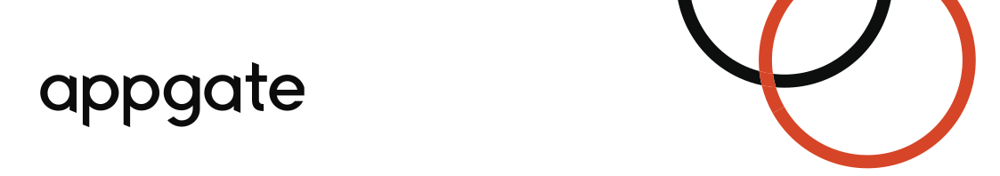

## Prueba Técnica.

**Nombre:** _____________

**Cargo:**  _____________

### Ambiente de desarrollo

Esta prueba técnica hace uso de [devcontainers](https://code.visualstudio.com/docs/remote/create-dev-container) de vs-code. Principalmente para facilitar el uso del IDE con el pluging de diagramas de draw.io, Java 11 y Node JS. La solucinón puede ser codificada en cualquiera de estas tecnologías.

Usted puede usar el IDE de su elección.

### ¿Qué esperamos de la prueba?

Evaluaremos patrones de diseño, prácticas de codificación, forma de despliegue. Por supuesto cumplir el requerimiento funcional es importante, pero para el cargo al que aspiras es muy necesario las otras cosas.

## Contexto.

Los atacantes usan domino con caracteres especiales a fin de confundir a los usuarios finales.

Por Ejemplo Neko Bank cuyo dominio es **nekobank.com** se le puede crear un dominio similar **лекobank.com**.

Nuestro servicio posee una base datos de información muy amplia para detectar este tipo de casos comparando los dominios de nuestros clientes sin TLD contra los dominios que se registran día a día y reportamos a ellos si hay dominios similares o que contengan su marca (dominio sin TLD) en el domino.

En la carpeta de [data](data/dominios.txt)

Muchos dominios vienen en caracteres americanos, pero aquellos que no usan una codificación llamada punycode. En línea hay conversores de esta información [ejemplo](https://www.punycoder.com/).

**Revise el diagrama:** [flujo general](diagramas/procesoGeneral.drawio)

## Requerimiento Funcional

**RF1:** Nuestro cliente Bancolombia quiere detectar dominios similares potencialmente peligrosos para phishing.

Dominios a proteger:  bancolombia.com y bancolombia.com.co

Ustede debe realizar la busqueda de dominios similares en el archivo dado y guardar en un formato json como el siguiente los encontrados

```json
{
    dominio:"bancolombia.com",
    dominios_similares:[],
    dominios_sim_punycode:[]
}
```

---

**RF2:** Como Agente de soporte nivel2, quiero tener una base de datos para buscar dominios que los clientes nos repotan como no detectados para
saber si efectivamente fue procesado por nosotros.

---

**RF3:** Como Agente de soporte nivel1, necesito un medio gráfico de consulta para buscar dominios que los clientes nos reportan como no detectados.(elabora fronted y backend)

## Requerimientos no Funcionales.

La empresa procesa cerca 50.000 archivos de este estilo diariamente para un promedio diario de 500.000 dominios la solución debe estar pensada escalar y soportar cargas similares o mayores.

La base de datos para las personas de soporte debe ser un **postgresql** el cual puede instalar en el [Dockerfile](.devcontainer/Dockerfile)

La entrega se debe hacer por medio de github público que podamos consultar.

El README de complementarse para indicar como correr las pruebas unitarias y contener lo siguiente:

        ◦ Como construirlo o empaquetarlo
        ◦ Como dockerizarlo o construir la imagen de docker
        ◦ Como ejecutar sus pruebas
        ◦ Como ejecutar el contenedor de Docker
        ◦ CURL para utilizar API
        ◦ Genere un diagrama de arquitectura de la solución 
        ◦ Un diagrama de como seria la estrategia de CI/CD que usted propone

# Entregables

|Artefacto   |Ponderación   |
|---|---|
|Implementación Requerimientos funcionales   |40   |
|Historial de Commits   |5   |
|Readme   |10   |
|Pruebas Unitarias|30|
|Despliegue        |15|

Para presentar la prueba hacer fork de este proyecto y finalmente un pull request para una rama con tu nombre.

